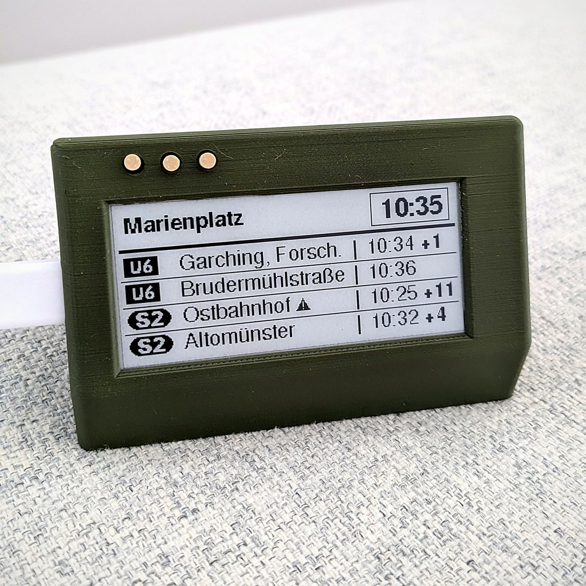
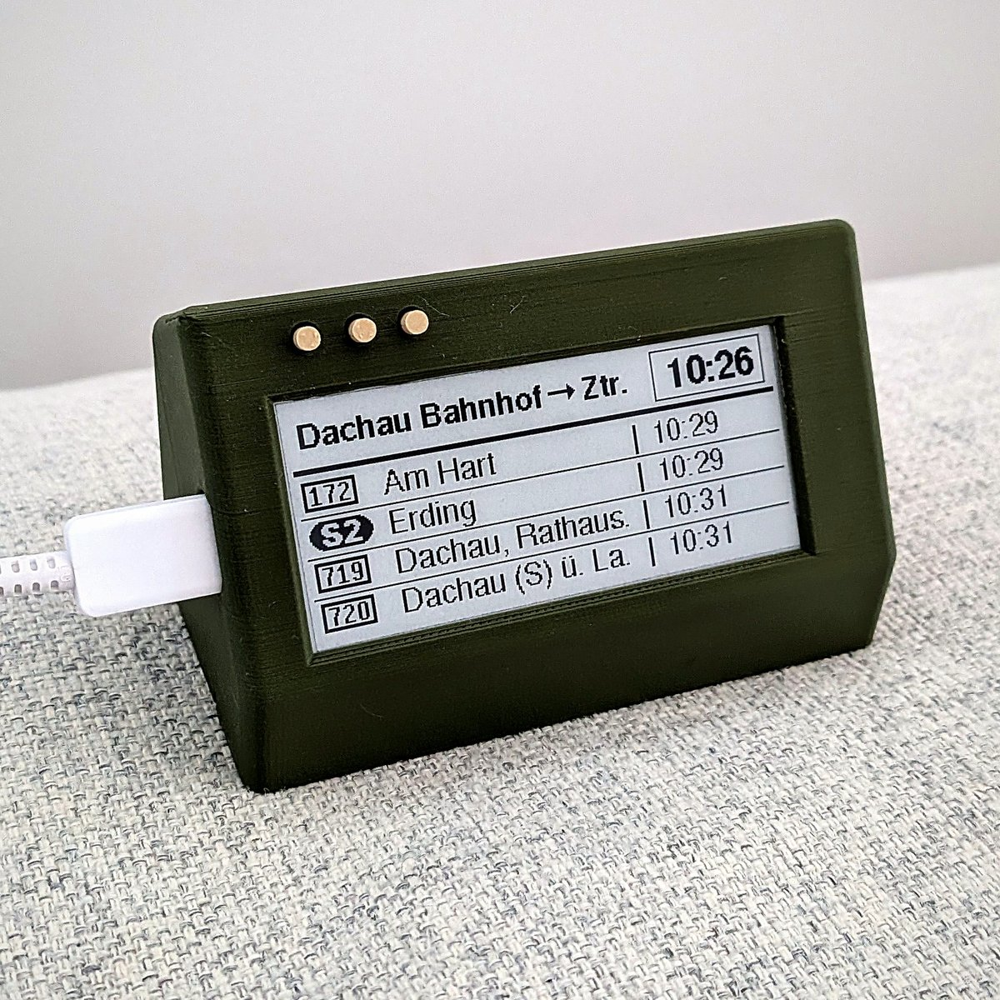
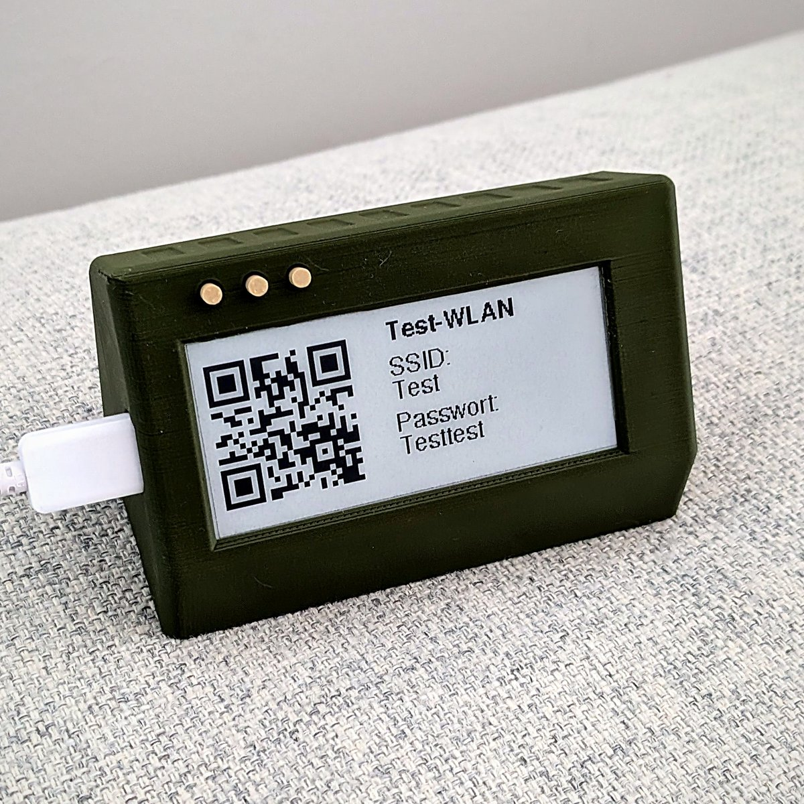

# MVG-Abfahrtsdisplay (Heltec Vision Master E290)

  
  
  

Ein kleines E-Ink-Display für zu Hause, das die nächsten Abfahrten an deiner
Münchner Haltestelle zeigt – live, mit Verspätungen, Ausfällen und
Störungshinweisen. Es läuft dauerhaft am USB-Netzteil und aktualisiert sich
jede Minute.

**Einrichten geht komplett im Browser**, ohne Programmierkenntnisse:
Firmware über den
**[Web-Installer](https://fluddel94.github.io/MVG_Abfahrtsdisplay_E290/)**
aufspielen, WLAN eingeben, Haltestelle auswählen – fertig.

> **Hinweis:** Die Abfahrten stammen aus der **inoffiziellen, nicht
> dokumentierten Schnittstelle der MVG**. Das Projekt steht in keiner
> Verbindung zur MVG, zum MVV oder zur Deutschen Bahn. Laut Impressum der
> MVG wird eine *gemäßigte Nutzung für private, nicht-kommerzielle Zwecke*
> ohne ausdrückliche Zustimmung geduldet. Die Schnittstelle kann sich
> jederzeit ändern oder abgeschaltet werden. Gedacht ist das Display nur für
> das MVG-/MVV-Gebiet.

Wer selbst kompilieren oder den Code ändern möchte: **[README_TECHNIK.md](README_TECHNIK.md)**.
Änderungen je Version: [CHANGELOG.md](CHANGELOG.md).

---

## Was das Display kann

- **Die nächsten 4 Abfahrten** mit Linie, Ziel, Uhrzeit und Verspätung
  (z.B. `+3`). Pünktliche Abfahrten zeigen nur die Uhrzeit.
- **Zwei Anzeigearten:** alle Richtungen gemischt (mit einer zweiten Seite
  für Abfahrt 5–8) oder getrennt nach „Zentrum“ und „Auswärts“.
- **Verkehrsmittel auswählbar:** S-Bahn, U-Bahn, Tram, Bus, Regionalzug.
- **Liniensymbole** wie an der Haltestelle.
- **Ausfälle und Störungen:** Fällt ein Zug aus, ist die Uhrzeit
  durchgestrichen; bei Störungen erscheint ein Warndreieck. Endet ein Zug
  früher, steht das tatsächliche Ziel da.
- **Geteilte Züge** (z.B. S1 Flughafen / Freising) erscheinen als eine Zeile –
  auch Regionalzüge, deren Zugteile verschiedene Liniennummern haben (z.B.
  BRB RB 55/56/57, Symbol „RB“, Ziele gekürzt: „Lenggri./Tegerns.“).
- **Ersatzverkehr:** Ersatzbusse für Züge, S-Bahn oder Tram erscheinen als „SEV“.
- **Alles im Browser einstellbar** – auch vom Handy aus, über das
  [Einstellungsportal](#einstellungsportal).
- **Updates ohne Datenverlust:** Haltestelle, WLAN und Einstellungen bleiben
  erhalten.
- **Optional:** QR-Code für dein Gäste-WLAN auf Knopfdruck.

## Das brauchst du

- **Heltec Vision Master E290** (Board mit eingebautem 2,9"-E-Ink-Display)
- **USB-C-Kabel, das Daten überträgt** – reine Ladekabel funktionieren nicht
- **USB-Netzteil** für den Dauerbetrieb
- **PC oder Mac** mit **Chrome**, **Edge** oder **Firefox ab Version 151**
  (Safari und Handys gehen für die Einrichtung nicht)
- **WLAN mit 2,4 GHz** (5 GHz allein reicht nicht)
- optional: 3D-Drucker für das [Gehäuse](#gehäuse)

## Einrichtung

Öffne den **[Web-Installer](https://fluddel94.github.io/MVG_Abfahrtsdisplay_E290/)**.
Sein Dialog ist englisch – die Knöpfe stehen deshalb unten *kursiv* im
Original.

1. Display per USB an den PC anstecken, auf **Installieren** klicken.
   Firefox fragt vorher, ob die Seite auf serielle Geräte zugreifen darf –
   erlauben.
2. Im Browser-Fenster das Display auswählen (heißt meist *USB JTAG/serial
   debug unit*) und *Connect* klicken.
3. *Install MVG Abfahrtsdisplay* wählen, **Erase device anhaken** und
   bestätigen. Dabei wird die von Heltec
   vorinstallierte Software gelöscht. Das Aufspielen dauert etwa eine Minute.
4. *Connect to Wi-Fi*: dein WLAN wählen und das Passwort eingeben.
5. *Visit device* öffnet die Einstellungen des Displays im Browser.
   (Das Display zeigt dazu auch einen QR-Code – damit geht es vom Handy aus.)
6. Haltestelle suchen, auswählen und **Speichern**. Das Display zeigt sofort
   die Abfahrten.
7. USB-Kabel vom PC abziehen, Display ins Gehäuse und ans Netzteil – fertig.

Klappt etwas nicht? Siehe [Hilfe bei Problemen](#hilfe-bei-problemen).

## Bedienung

Über dem Display sitzen drei Tasten nebeneinander. Von vorne gesehen:
**links** (auf dem Board „BOOT“), **Mitte** (auf dem Board „21“),
**rechts** (auf dem Board „RST“ – startet das Display neu).

| Taste | Was passiert |
|---|---|
| **Linke Taste** kurz drücken | gemischte Anzeige: Seite 2 (Abfahrt 5–8) · getrennte Anzeige: andere Richtung. Nach 30 s geht es von selbst zurück. |
| **Mittlere Taste** 3 Sekunden halten | System-Info für 60 s – und das [Einstellungsportal](#einstellungsportal) öffnet sich für 30 Minuten. Nochmal 3 s halten = zurück. |
| **Mittlere Taste** kurz drücken | QR-Code fürs Gäste-WLAN für 60 s (nur wenn eingeschaltet) |

## Einstellungsportal

Das Display hat eine eigene kleine Webseite. Dort stellst du alles ein –
vom PC oder Handy, solange es im selben WLAN ist. Änderungen gelten sofort
nach dem Speichern.

**So öffnest du es:** die mittlere Taste drei Sekunden halten. Das Display zeigt
dann die Adresse (z.B. `http://192.168.178.42`) – diese im Browser eintippen.
Das Portal bleibt 30 Minuten offen. Bei der ersten Einrichtung führt
*Visit device* im Web-Installer direkt hin.

**Was du einstellen kannst:**

- **Station:** Namen eintippen und *Suchen*. Bei gleichnamigen Haltestellen
  hilft der Link zur Karte. Mit *Auswählen* übernehmen.
- **Anzeige:** alle Richtungen gemischt oder getrennt nach Zentrum und
  Auswärts. Für „getrennt“ zeigt *Richtungen anzeigen*, welche Linien und
  Ziele zu welcher Kennung (H oder R) gehören – so legst du fest, welche
  davon Richtung Zentrum fährt.
- **Verkehrsmittel:** S-Bahn, U-Bahn, Tram, Bus, Regionalzug.
- **WLAN-QR-Code:** Überschrift, Name und Passwort des WLANs, das Gäste per
  QR-Code bekommen sollen. Das Passwort steht dann gut lesbar auf dem
  Display – nimm also nur ein WLAN, das du teilen möchtest.
- **Firmware aktualisieren:** siehe [Update](#update).
- **Werkseinstellungen:** löscht alle Einstellungen inklusive WLAN.

Das Portal hat kein eigenes Passwort. Während es offen ist, kann jeder in
deinem WLAN die Einstellungen ändern – deshalb schließt es sich nach
30 Minuten von selbst.

## Update

Haltestelle, WLAN und Einstellungen bleiben bei beiden Wegen erhalten.

- **Mit Kabel:** Web-Installer öffnen, **Installieren**, Display wählen,
  *Update MVG Abfahrtsdisplay*.
  Fragt der Installer nach *Erase device*: Häkchen **weglassen**, sonst sind
  WLAN und Haltestelle weg.
- **Ohne Kabel:** Datei `firmware.bin` aus dem
  [aktuellen Release](https://github.com/Fluddel94/MVG_Abfahrtsdisplay_E290/releases/latest)
  herunterladen, im Portal unter *Firmware aktualisieren* auswählen und
  *Hochladen*. Das Display startet danach neu.

## WLAN ändern

Display per USB an den PC, Web-Installer öffnen, **Installieren**, Display
wählen, *Change Wi-Fi*. Klappt die Verbindung nicht, bleibt das bisherige
WLAN gespeichert.

## Hilfe bei Problemen

### Das Display taucht im Browser-Fenster nicht auf
Ein anderes USB-Kabel (es muss Daten übertragen) oder einen anderen
USB-Anschluss probieren.

### Der PC piept im Sekundentakt
Auf dem Display ist keine Software (z.B. nach einer abgebrochenen
Installation), es startet ständig neu. Dann hilft die Notlösung.

### Notlösung
Kabel abziehen. Die **linke Taste** (BOOT) gedrückt halten und dabei das Kabel
einstecken, nach zwei Sekunden loslassen. Dann im Web-Installer
**Installieren**.
**Wichtig:** Nach dem Aufspielen startet das Display erst, wenn du das
Kabel einmal ab- und wieder ansteckst – bis dahin tut sich auf dem
Bildschirm nichts. Danach **Installieren** → *Connect to Wi-Fi*.

### Nach der Installation fehlt *Connect to Wi-Fi*
Kabel ab- und wieder anstecken, etwa zehn Sekunden warten (das Display
zeigt „Keine WLAN-Daten“), dann erneut **Installieren**.

### Mein WLAN fehlt in der Liste
Dialog schließen und *Connect to Wi-Fi* nochmal öffnen – oder unten
*Join other…* wählen und den WLAN-Namen selbst eintippen. Das Display kann
nur 2,4-GHz-WLAN.

### Das Display zeigt „Keine WLAN-Daten“
Es ist noch kein WLAN gespeichert (z.B. nach den Werkseinstellungen): per
USB im Web-Installer *Connect to Wi-Fi*.

### Das Display zeigt einen WLAN-Fehler
Es nennt die vermutete Ursache (z.B. „Passwort falsch?“) und versucht es
alle 10 Sekunden erneut. Stimmt das Passwort nicht: im Web-Installer
*Change Wi-Fi*.

### Das Portal lässt sich nicht öffnen
Es ist nur 30 Minuten nach dem Öffnen erreichbar: die mittlere Taste
drei Sekunden halten und die angezeigte Adresse verwenden. PC oder Handy müssen
im selben WLAN sein.

## Gut zu wissen

- An großen Stationen erscheinen alle Linien der gewählten Verkehrsmittel
  gemischt – einzelne Linien lassen sich nicht auswählen.
- Pünktliche Abfahrten sehen genauso aus wie Abfahrten ohne Live-Daten.
- Ersatzbusse (SEV) erscheinen beim ersetzten Verkehrsmittel – der Ersatzbus
  für die S2 also auch, wenn nur „S-Bahn“ eingeschaltet ist. Live-Daten
  haben sie meist nicht.
- Lange Stationsnamen werden im Kopf gekürzt („.“ am Ende).

Mehr Details: [README_TECHNIK.md](README_TECHNIK.md#einschränkungen-im-detail).

## Gehäuse

Im Ordner [`gehaeuse/`](gehaeuse/) liegt ein Gehäuse zum 3D-Drucken. Es ist
ein Remix von **„Vision Master E290 V0.3.1 case for Meshtastic“** von
**HarukiToreda** ([Printables 974647](https://www.printables.com/model/974647)),
lizenziert unter [CC BY 4.0](https://creativecommons.org/licenses/by/4.0/).
Änderungen: Antennenanschluss entfernt, Schrift- und Logovertiefungen
entfernt, das Gehäuse steht geneigt auf dem Tisch. Der Remix steht ebenfalls unter CC BY 4.0.
Die Druckdateien gibt es auch auf
[MakerWorld](https://makerworld.com/de/models/3385427-heltec-e290-munich-departure-display-mvg-mvv).

## Lizenz

- **Code:** [GNU General Public License v3.0 oder später](LICENSE)
  (GPL-3.0-or-later).
- **Schriften** `src/FreeSans9pt8b.h`, `src/FreeSansBold9pt8b.h`: abgeleitet
  aus den Adafruit-GFX-Schriften bzw. aus
  [GNU FreeFont](https://www.gnu.org/software/freefont/) (GPL-3.0-or-later
  mit Font-Ausnahme).
- **Liniensymbole** S-Bahn/U-Bahn: konvertiert aus SVG-Dateien von
  [Wikimedia Commons](https://commons.wikimedia.org/), dort als gemeinfrei
  gekennzeichnet. Tram-, Nacht-Tram-, Bus- und Zug-Symbole sind eigene
  Pixelgrafiken. Die Liniensymbole können Marken der jeweiligen Inhaber
  (MVV, MVG, DB) sein.
- **Haltestellenliste** `haltestellen/`: Münchner Verkehrs- und
  Tarifverbund GmbH (MVV), CC BY 4.0, Details in
  [`haltestellen/README.md`](haltestellen/README.md).
- **Gehäuse:** CC BY 4.0, siehe [Gehäuse](#gehäuse).
- **Web-Installer:** nutzt [ESP Web Tools](https://github.com/esphome/esp-web-tools)
  (Apache-2.0), geladen von unpkg.com, nicht in diesem Repository enthalten.
- Verwendete Libraries (nicht in diesem Repository enthalten) stehen unter
  ihren eigenen Lizenzen.

Bei der Entwicklung hat uns Claude (Anthropic) mit Agentic Coding unterstützt.

Keine Gewähr für Richtigkeit und Vollständigkeit der angezeigten Daten.
