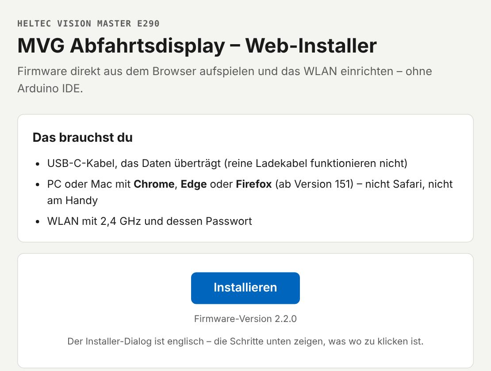
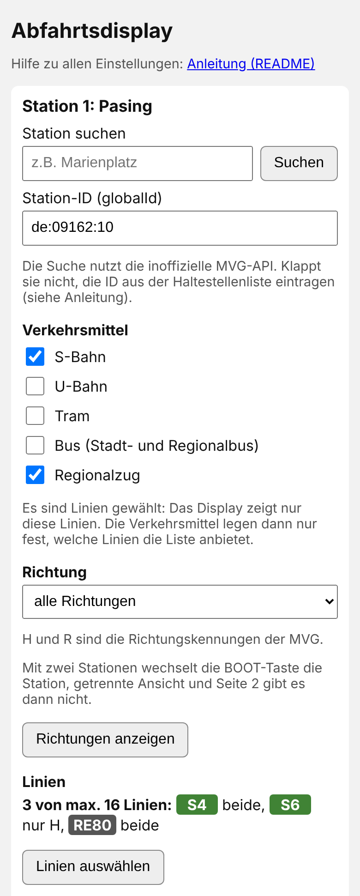
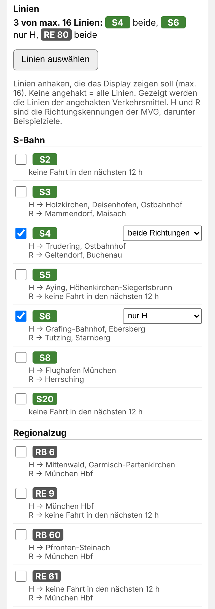

# MVG Departure Display (Heltec Vision Master E290)

[Deutsch](README.md) | **English**

  
  
  

A small e-ink display for your home that shows the next departures at your
Munich stop – live, with delays, cancellations and disruption notices.
Optionally only selected lines and directions, and with a second stop that
a button switches to. It runs permanently on a USB power supply and updates
every minute.

**Setup works entirely in the browser**, no programming required: flash the
firmware with the
**[web installer](https://fluddel94.github.io/MVG_Abfahrtsdisplay_E290/)**,
enter your Wi-Fi, pick your stop – done.

> **Note:** The departures come from the **unofficial, undocumented
> interface of MVG** (Munich's public transport company). This project is
> not affiliated with MVG, MVV or Deutsche Bahn. According to MVG's legal
> notice, *moderate use for private, non-commercial purposes* is tolerated
> without explicit permission. The interface may change or be switched off
> at any time. The display is intended for the MVG/MVV area only.

The display, the settings portal and the web installer are in German. This
page explains everything in English.

Want to compile the firmware yourself or change the code?
**[README_TECHNIK_EN.md](README_TECHNIK_EN.md)**.
Changes per version: [CHANGELOG.md](CHANGELOG.md) (German).

---

## What the display does

- **The next 4 departures** with line, destination, time and delay
  (e.g. `+3`). Departures on time show the time only.
- **Directions:** all mixed (with a second page for departures 5–8),
  split into "Zentrum" (towards the city centre) and "Auswärts" (outbound),
  switched with a button, or one direction only.
- **Selectable modes of transport:** S-Bahn, U-Bahn, tram, bus, regional
  train.
- **Line selection:** only the lines you care about – per line both
  directions or just one (up to 16 lines per stop).
- **Second stop:** e.g. the bus at your door and the S-Bahn around the
  corner. The left button switches, after 30 s it returns to the first one.
- **Line symbols** like at the stop.
- **Cancellations and disruptions:** if a train is cancelled, the time is
  struck through; disruptions show a warning triangle. If a train ends
  early, the actual destination is shown.
- **Split trains** (e.g. S1 airport / Freising) appear as one row – also
  regional trains whose parts have different line numbers (e.g. BRB
  RB 55/56/57, symbol "RB", destinations shortened: "Lenggri./Tegerns.").
- **Rail replacement:** replacement buses for trains, S-Bahn or tram appear
  as "SEV".
- **Short outages stay invisible:** if the MVG interface or the Wi-Fi drops
  briefly, the departures stay on screen for up to a minute before an error
  is shown.
- **Everything is set up in the browser** – also from your phone, via the
  [settings portal](#settings-portal).
- **Updates keep your data:** stop, Wi-Fi and settings are preserved.
- **Optional:** QR code for your guest Wi-Fi at the push of a button.

## What you need

- **Heltec Vision Master E290** (board with built-in 2.9" e-ink display)
- **USB-C cable that transfers data** – charge-only cables don't work
- **USB power supply** for permanent operation
- **PC or Mac** with **Chrome**, **Edge** or **Firefox 151 or later**
  (Safari and phones can't be used for setup)
- **2.4 GHz Wi-Fi** (5 GHz alone is not enough)
- optional: 3D printer for the [case](#case)

## Setup

Open the **[web installer](https://fluddel94.github.io/MVG_Abfahrtsdisplay_E290/)**.
The page is in German, its dialog is in English.

  

1. Connect the display via USB to your computer and click **Installieren**
   (install). Firefox first asks whether the page may access serial
   devices – allow it.
2. In the browser window, select the display (usually called *USB
   JTAG/serial debug unit*) and click *Connect*.
3. Choose *Install MVG Abfahrtsdisplay*, **tick Erase device** and confirm.
   This deletes the software Heltec pre-installed. Flashing takes about a
   minute.
4. *Connect to Wi-Fi*: choose your Wi-Fi and enter the password.
5. *Visit device* opens the display's settings in the browser. (The display
   also shows a QR code for this – handy from your phone.)
6. Search for your stop, select it and click **Speichern** (save). The
   display shows the departures right away.
7. Unplug from the computer, put the display in its case and connect the
   power supply – done.

Something not working? See [Troubleshooting](#troubleshooting).

## Operation

There are three buttons side by side above the display. Seen from the
front: **left** (labelled "BOOT" on the board), **middle** (labelled "21"),
**right** (labelled "RST" – restarts the display).

| Button | What happens |
|---|---|
| **Left button**, short press | with a second stop: switch to the other stop · otherwise in mixed view: page 2 (departures 5–8), in split view: other direction. After 30 s it returns by itself. |
| **Middle button**, hold 3 seconds | system info for 60 s – and the [settings portal](#settings-portal) opens for 30 minutes. Hold 3 s again = back. |
| **Middle button**, short press | QR code for the guest Wi-Fi for 60 s (only if enabled) |

## Settings portal

The display has its own small web page where you set everything – from a
computer or phone on the same Wi-Fi. Changes apply as soon as you save.

**How to open it:** hold the middle button for three seconds. The display
then shows the address (e.g. `http://192.168.178.42`) – type it into your
browser. The portal stays open for 30 minutes. During first setup,
*Visit device* in the web installer takes you there directly.

  
  

**What you can set** (German labels in *italics*):

- **Station 1:** type a name and click *Suchen* (search). For stops with the
  same name, the map link helps. Confirm with *Auswählen* (select). The
  name of the selected stop then appears in the heading.
- **Verkehrsmittel** (modes of transport): S-Bahn, U-Bahn, Tram, Bus
  (city and regional bus), Regionalzug (regional train).
- **Richtung** (direction): all directions, split into Zentrum/Auswärts
  (H/R), or only direction H or R. *H* and *R* are MVG's direction codes;
  *Richtungen anzeigen* (show directions) lists which lines and
  destinations belong to which code. For the split view you choose which
  of them runs towards the city centre.
- **Linien** (lines): *Linien auswählen* (select lines) lists all lines of
  the ticked modes of transport with example destinations per direction
  (loading takes about 10 seconds). Tick lines and choose per line
  *beide Richtungen* (both directions), *nur H* or *nur R* – up to 16
  lines. Without ticks, the display shows all lines of the selected modes
  of transport. *Fertig* (done) collapses the list.
- **Station 2 (optional):** *Zweite Station hinzufügen* (add second stop) –
  with its own modes of transport, direction and lines. The left button
  then switches between both; the header shows the stop's number. Split
  view and page 2 are only available with a single stop.
- **WLAN-QR-Code** (Wi-Fi QR code): heading, name and password of the Wi-Fi
  your guests should get via QR code. The password is shown clearly
  readable on the display – so only use a network you want to share.
- **Firmware aktualisieren** (update firmware): see [Update](#update).
- **Werkseinstellungen** (factory reset): deletes all settings including
  Wi-Fi.

The portal has no password of its own. While it is open, anyone on your
Wi-Fi can change the settings – that is why it closes by itself after
30 minutes.

## Update

Stop, Wi-Fi and settings are preserved either way.

- **With cable:** open the web installer, **Installieren**, select the
  display, *Update MVG Abfahrtsdisplay*. If the installer asks about
  *Erase device*: **leave it unticked**, otherwise Wi-Fi and stop are gone.
- **Without cable:** download `firmware.bin` from the
  [latest release](https://github.com/Fluddel94/MVG_Abfahrtsdisplay_E290/releases/latest),
  select it in the portal under *Firmware aktualisieren* and click
  *Hochladen* (upload). The display restarts afterwards.

## Change Wi-Fi

Connect the display via USB, open the web installer, **Installieren**,
select the display, *Change Wi-Fi*. If the connection fails, the previous
Wi-Fi stays stored.

## Troubleshooting

### The display doesn't show up in the browser window
Try a different USB cable (it must transfer data) or a different USB port.

### The computer beeps every second
There is no software on the display (e.g. after an aborted installation),
so it keeps restarting. Use the fallback below.

### Fallback
Unplug the cable. Hold the **left button** (BOOT) while plugging the cable
in, release after two seconds. Then click **Installieren** in the web
installer.
**Important:** after flashing, the display only starts once you unplug and
replug the cable – until then nothing happens on the screen. Then
**Installieren** → *Connect to Wi-Fi*.

### *Connect to Wi-Fi* is missing after installation
Unplug and replug the cable, wait about ten seconds (the display shows
"Keine WLAN-Daten" – no Wi-Fi data), then click **Installieren** again.

### My Wi-Fi is not in the list
Close the dialog and open *Connect to Wi-Fi* again – or choose *Join
other…* at the bottom and type the Wi-Fi name yourself. The display only
supports 2.4 GHz Wi-Fi.

### The display shows "Keine WLAN-Daten"
No Wi-Fi is stored yet (e.g. after a factory reset): connect via USB and
use *Connect to Wi-Fi* in the web installer.

### The display shows a Wi-Fi error
It appears when the Wi-Fi has been gone for more than a minute (20 seconds
at startup). The display names the likely cause (e.g. "Passwort falsch?" –
wrong password?) and retries every 10 seconds. If the password is wrong:
*Change Wi-Fi* in the web installer.

### The display shows an error fetching departures
The MVG interface hasn't answered for over a minute (e.g. maintenance). The
display retries every 10 seconds and shows the departures again by itself
as soon as it works.

### The portal can't be opened
It is only reachable for 30 minutes after opening: hold the middle button
for three seconds and use the address shown. Computer or phone must be on
the same Wi-Fi.

## Good to know

- Without a line selection, all lines of the selected modes of transport
  are shown mixed at large stations.
- Rarely served lines at large stations: the preview covers about
  90 minutes. If a selected line runs less often, rows stay empty.
- Replacement buses for regional trains appear as soon as any regional
  train is selected – MVG only provides the train number, not the line.
- With two stops, the display shows four departures per stop.
- Departures on time look the same as departures without live data.
- Replacement buses (SEV) appear with the mode of transport they replace –
  the replacement bus for the S2 also shows when only "S-Bahn" is enabled.
  They usually have no live data.
- Outside Munich, MVG often names stops without the town (e.g. "Stadt
  Busbahnhof" instead of "Wasserburg Stadt Busbahnhof").
- Long stop names are shortened in the header ("." at the end).

More details: [README_TECHNIK_EN.md](README_TECHNIK_EN.md#limitations-in-detail).

## Case

The folder [`gehaeuse/`](gehaeuse/) contains a 3D-printable case. It is a
remix of **"Vision Master E290 V0.3.1 case for Meshtastic"** by
**HarukiToreda** ([Printables 974647](https://www.printables.com/model/974647)),
licensed under [CC BY 4.0](https://creativecommons.org/licenses/by/4.0/).
Changes: antenna connector removed, text and logo recesses removed, the case
stands tilted on the table. The remix is also licensed under CC BY 4.0.
The print files are also available on
[MakerWorld](https://makerworld.com/de/models/3385427-heltec-e290-munich-departure-display-mvg-mvv).

## License

- **Code:** [GNU General Public License v3.0 or later](LICENSE)
  (GPL-3.0-or-later).
- **Fonts** `src/FreeSans9pt8b.h`, `src/FreeSansBold9pt8b.h`: derived from
  the Adafruit GFX fonts and
  [GNU FreeFont](https://www.gnu.org/software/freefont/) (GPL-3.0-or-later
  with font exception).
- **Line symbols** S-Bahn/U-Bahn: converted from SVG files on
  [Wikimedia Commons](https://commons.wikimedia.org/), marked there as
  public domain. Tram, night tram, bus and train symbols are our own pixel
  graphics. The line symbols may be trademarks of their respective owners
  (MVV, MVG, DB).
- **Stop list** `haltestellen/`: Münchner Verkehrs- und Tarifverbund GmbH
  (MVV), CC BY 4.0, details in
  [`haltestellen/README.md`](haltestellen/README.md).
- **Case:** CC BY 4.0, see [Case](#case).
- **Web installer:** uses [ESP Web Tools](https://github.com/esphome/esp-web-tools)
  (Apache-2.0), loaded from unpkg.com, not included in this repository.
- Libraries used (not included in this repository) are under their own
  licenses.

Claude (Anthropic) supported the development with agentic coding.

No guarantee for the correctness and completeness of the data shown.
